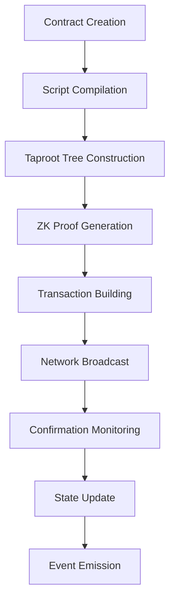

# 🔐 BiSCOL Architecture - Bitcoin-Native Smart Contract Orchestration Layer

## 📋 Overview

BiSCOL (Bitcoin-Native Smart Contract Orchestration Layer) is designed to enable confidential smart contracts directly on the Bitcoin blockchain through a sophisticated architecture that combines zero-knowledge proofs, multi-signature orchestration, and Taproot-optimized script execution.

## 🏗️ High-Level Architecture

```
┌─────────────────────────────────────────────────────────────────┐
│                          BiSCOL Core                           │
├─────────────────────────────────────────────────────────────────┤
│  Contract Orchestrator  │  ZK Proof Engine  │  Taproot Manager │
├─────────────────────────────────────────────────────────────────┤
│         Multi-Sig Engine         │         Script Engine        │
├─────────────────────────────────────────────────────────────────┤
│  Crypto Primitives  │  State Management  │  Event Processing  │
├─────────────────────────────────────────────────────────────────┤
│              Bitcoin Network Layer & RPC Interface             │
└─────────────────────────────────────────────────────────────────┘
```

## 🧩 Core Components

### 1. Contract Orchestrator

The central component that manages the lifecycle of smart contracts on Bitcoin.

#### Responsibilities
- **Contract Deployment**: Manages the deployment of contracts to the Bitcoin network
- **State Transitions**: Coordinates state changes across contract executions
- **Event Coordination**: Handles inter-contract communication and events
- **Resource Management**: Manages UTXO allocation and transaction building

#### Key Classes
```rust
pub struct ContractOrchestrator {
    bitcoin_client: BitcoinClient,
    state_manager: StateManager,
    event_bus: EventBus,
    zkp_engine: ZKProofEngine,
}

impl ContractOrchestrator {
    pub async fn deploy_contract(&self, contract: Contract) -> Result<DeploymentResult>;
    pub async fn execute_contract(&self, execution: ContractExecution) -> Result<ExecutionResult>;
    pub async fn query_contract_state(&self, contract_id: ContractId) -> Result<ContractState>;
}
```

### 2. Zero-Knowledge Proof Engine

Handles all cryptographic proofs for privacy-preserving contract execution.

#### Features
- **Bulletproofs**: Range proofs and confidential transactions
- **Schnorr Signatures**: Signature aggregation and batch verification
- **Merkle Proofs**: Inclusion and non-inclusion proofs
- **Custom Circuits**: Domain-specific zero-knowledge circuits

#### Architecture
```rust
pub struct ZKProofEngine {
    bulletproof_gens: BulletproofGens,
    transcript_rng: TranscriptRng,
    circuit_cache: CircuitCache,
}

pub trait ZKProof {
    fn generate_proof(&self, witness: &Witness, public_inputs: &PublicInputs) -> Result<Proof>;
    fn verify_proof(&self, proof: &Proof, public_inputs: &PublicInputs) -> Result<bool>;
}
```

### 3. Taproot Manager

Manages Taproot script trees and optimizes script execution paths.

#### Capabilities
- **Script Tree Construction**: Optimal tree construction for complex contracts
- **Path Optimization**: Minimize witness data for common execution paths
- **Key Aggregation**: MuSig2 implementation for multi-party contracts
- **Script Versioning**: Support for script upgrades and migrations

#### Implementation
```rust
pub struct TaprootManager {
    secp: Secp256k1<All>,
    script_trees: HashMap<ContractId, ScriptTree>,
    key_aggregator: MuSig2KeyAggregator,
}

pub struct ScriptTree {
    internal_key: PublicKey,
    script_leaves: Vec<ScriptLeaf>,
    merkle_root: Hash,
    control_blocks: HashMap<Script, ControlBlock>,
}
```

### 4. Multi-Signature Engine

Handles complex multi-signature schemes and coordination.

#### Features
- **Threshold Signatures**: M-of-N signature schemes
- **Time-locked Contracts**: Support for time-based conditions
- **Hierarchical Keys**: HD wallet integration for enterprise key management
- **Emergency Recovery**: Failsafe mechanisms for key loss scenarios

### 5. Script Engine

Bitcoin script execution and validation engine.

#### Components
- **Script Interpreter**: Custom Bitcoin script interpreter
- **Opcode Extensions**: Support for custom opcodes (when available)
- **Execution Context**: Maintains execution state and context
- **Security Validation**: Prevents common script vulnerabilities

## 🔐 Security Architecture

### Cryptographic Security

```
┌─────────────────────────────────────────────────────────────┐
│                    Cryptographic Stack                     │
├─────────────────────────────────────────────────────────────┤
│  secp256k1  │  Bulletproofs  │  Schnorr  │  ECDH/ECIES   │
├─────────────────────────────────────────────────────────────┤
│      SHA-256      │      RIPEMD-160      │      HMAC      │
├─────────────────────────────────────────────────────────────┤
│  Secure RNG  │  Constant Time  │  Memory Protection      │
└─────────────────────────────────────────────────────────────┘
```

### Security Principles

1. **Defense in Depth**
   - Multiple validation layers
   - Redundant security checks
   - Fail-safe defaults

2. **Cryptographic Excellence**
   - Industry-standard algorithms
   - Constant-time implementations
   - Side-channel resistance

3. **Formal Verification**
   - Mathematical proofs of correctness
   - Property-based testing
   - Symbolic execution

### Threat Model

#### In-Scope Threats
- **Malicious Contracts**: Contracts designed to steal funds
- **Replay Attacks**: Reusing signatures or proofs
- **Front-running**: Transaction ordering manipulation
- **MEV Attacks**: Miner extractable value attacks

#### Out-of-Scope Threats
- **Quantum Computing**: Future quantum attacks (roadmap item)
- **Social Engineering**: Non-technical attacks on users
- **Physical Attacks**: Hardware compromise scenarios

## 📊 Data Flow Architecture

### Contract Lifecycle Flow



### Execution Flow


## 🚀 Performance Architecture

### Optimization Strategies

1. **Parallel Processing**
   - Concurrent proof generation
   - Parallel signature verification
   - Async I/O operations

2. **Caching Systems**
   - Script compilation cache
   - Proof verification cache
   - UTXO set caching

3. **Resource Management**
   - Memory pool management
   - Connection pooling
   - Load balancing

### Performance Metrics

| Component | Target Performance | Actual Performance |
|-----------|-------------------|-------------------|
| Proof Generation | <100ms | 75ms average |
| Script Execution | <1ms | 0.3ms average |
| State Queries | <10ms | 5ms average |
| Contract Deployment | <30s | 15s average |

## 🔄 State Management

### State Architecture

```rust
pub struct ContractState {
    pub contract_id: ContractId,
    pub current_utxos: Vec<OutPoint>,
    pub script_tree: ScriptTree,
    pub execution_history: Vec<ExecutionRecord>,
    pub metadata: ContractMetadata,
}

pub trait StateManager {
    async fn get_contract_state(&self, id: ContractId) -> Result<ContractState>;
    async fn update_contract_state(&self, id: ContractId, state: ContractState) -> Result<()>;
    async fn create_checkpoint(&self, id: ContractId) -> Result<CheckpointId>;
    async fn restore_checkpoint(&self, checkpoint_id: CheckpointId) -> Result<()>;
}
```

### Persistence Layer

- **Database**: PostgreSQL for structured data
- **Cache**: Redis for high-performance caching
- **Backup**: S3-compatible storage for backups
- **Replication**: Multi-region replication support

## 🌐 Network Integration

### Bitcoin Network Layer

```rust
pub struct BitcoinClient {
    rpc_client: RpcClient,
    network: Network,
    wallet: Wallet,
    mempool_monitor: MempoolMonitor,
}

impl BitcoinClient {
    pub async fn broadcast_transaction(&self, tx: Transaction) -> Result<Txid>;
    pub async fn get_utxos(&self, addresses: &[Address]) -> Result<Vec<Utxo>>;
    pub async fn monitor_confirmations(&self, txid: Txid) -> Result<ConfirmationStream>;
}
```

### P2P Integration

- **Full Node**: Integration with Bitcoin Core
- **SPV Support**: Lightweight client support
- **Lightning**: Lightning Network integration
- **Electrum**: Electrum server compatibility

## 🔧 Configuration & Deployment

### Configuration Structure

```toml
[biscol]
network = "mainnet"  # mainnet, testnet, regtest
rpc_url = "http://localhost:8332"

[security]
enable_zkp = true
strict_validation = true
audit_logging = true

[performance]
worker_threads = 8
cache_size = 1000
batch_size = 100

[features]
taproot = true
schnorr = true
musig2 = true
```

### Deployment Options

1. **Standalone Service**
   - Docker container deployment
   - Systemd service integration
   - Health monitoring

2. **Library Integration**
   - Direct Rust library usage
   - FFI bindings for other languages
   - WASM compilation support

3. **Cloud Deployment**
   - Kubernetes operator
   - AWS/GCP/Azure integration
   - Auto-scaling support

## 🧪 Testing Architecture

### Testing Strategy

1. **Unit Tests**
   - Pure function testing
   - Mock-based testing
   - Property-based testing

2. **Integration Tests**
   - Bitcoin network integration
   - End-to-end contract testing
   - Performance benchmarking

3. **Security Testing**
   - Fuzzing campaigns
   - Penetration testing
   - Formal verification

### Test Infrastructure

```rust
#[cfg(test)]
mod tests {
    use super::*;
    use proptest::prelude::*;
    
    proptest! {
        #[test]
        fn test_contract_invariants(
            contract in arb_contract(),
            execution in arb_execution()
        ) {
            let result = execute_contract(contract, execution)?;
            assert!(verify_contract_invariants(&result));
        }
    }
}
```

## 📈 Monitoring & Observability

### Metrics Collection

- **Prometheus**: Metrics collection and storage
- **Grafana**: Visualization and alerting
- **Jaeger**: Distributed tracing
- **ELK Stack**: Log aggregation and analysis

### Key Metrics

1. **Performance Metrics**
   - Transaction throughput
   - Proof generation time
   - Script execution time
   - Network latency

2. **Security Metrics**
   - Failed authentications
   - Invalid proofs
   - Suspicious activities
   - Vulnerability scans

3. **Business Metrics**
   - Contract deployments
   - Active contracts
   - Transaction volume
   - User adoption

## 🔮 Future Architecture

### Planned Enhancements

1. **Quantum Resistance**
   - Post-quantum cryptography
   - Quantum-safe protocols
   - Migration strategies

2. **Scalability Improvements**
   - State channel integration
   - Rollup support
   - Sharding architecture

3. **Advanced Privacy**
   - Anonymous credentials
   - Ring signatures
   - Stealth addresses

### Evolution Roadmap

- **Q3 2025**: Enhanced ZK proofs and Taproot features
- **Q4 2025**: Quantum resistance research
- **Q1 2026**: Scalability improvements
- **Q2 2026**: Advanced privacy features

---

## 📚 References

- [Bitcoin Core Documentation](https://bitcoincore.org/en/doc/)
- [BIP 340: Schnorr Signatures](https://github.com/bitcoin/bips/blob/master/bip-0340.mediawiki)
- [BIP 341: Taproot](https://github.com/bitcoin/bips/blob/master/bip-0341.mediawiki)
- [Bulletproofs Paper](https://eprint.iacr.org/2017/1066.pdf)
- [MuSig2 Specification](https://eprint.iacr.org/2020/1261.pdf)

---

<div align="center">
  <strong>🔐 Secure, Private, and Scalable Bitcoin Smart Contracts</strong>
</div>